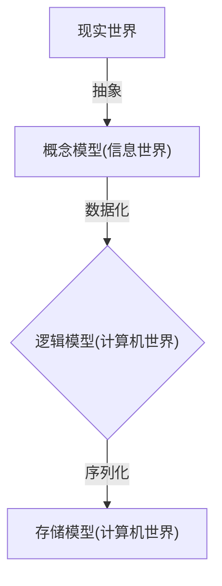

# DataBase 基础概述
当今信息社会离不开信息系统，而信息系统的核心就是数据库系统。**数据库技术**，是研究数据的存储、设计和使用的技术，简而言之可视为电子化的文件柜——存储电子文件的处所，用户可以对文件中的数据进行新增、截取、更新、删除等操作，现如今已经被广泛应用于各个领域，下面针对数据库的相关知识作一个简单的概述。

## 相关概念
**数据**(Data)：描述事物的符号记录称为数据，表现为文字，图形，图像，声音，语言等。

**数据库**(DataBase, 简称DB)：长期存储在计算机内的、有组织的、可共享的数据集合(数据库中的数据按一定的数据模型组织、描述和存储，具有较小的冗余度，和较高的数据独立性和易扩展性，并可为各种用户共享)。

**数据库管理系统**(DataBase Management System, 简称DBMS)：位于用户和操作系统之间的一层数据管理软件。其主要功能包括以下几点：
 * 数据定义(Data Definition Language)
 * 数据操作(Data Manipulation Language)
 * 数据库的运行管理(统一管理、统一控制、保证安全、完整、并发使用及故障恢复)
 * 数据库的建立和维护功能(初始数据输入，数据库转储、恢复，数据库重组织、性能监视、分析等)

**数据库系统**(DataBase System, 简称DBS)：在计算机系统中引入数据库后的系统，一般由数据库、数据库管理系统(及其开发工具)、应用系统、数据库管理员(DataBase Administrator, 简称DBA)和用户构成。它包含有以下几个特点：
 * 采用复杂的结构化的数据模型
 * 最低的冗余度
 * 有较高的数据独立性(用户面对的是简单的逻辑结构操作而不涉及数据具体的物理存储结构)
 * 安全性(设置用户的使用权限；在数据库被破坏时，系统有能力把数据库恢复到可用状态)
 * 完整性(系统采用一些完整性检验以确保数据符合某些规则，保证数据库中数据始终是正确的)

## 数据管理技术的发展
数据库技术是应数据管理任务的需要而产生的，是数据管理的最新技术，是计算机科学的重要分支。

数据管理技术的发展主要经历了人工管理阶段、文件系统阶段、数据库系统阶段三个阶段。

|  | 人工管理阶段 | 文件系统阶段 | 数据库系统阶段 |
|:----|:----|:----|:----|
|**数据存储方式** | 数据不保存 | 保存在文件中 | 保存在数据库中 |
|**数据组织方式** | 由程序自己决定 | 以记录为单位进行组织 | 数据结构化(数据模型) |
|**数据独立性** | 与程序不独立 | 有一定的独立性 | 独立性强 |
|**数据共享性** | 共享性差 | 有一定的共享性 | 共享性好 |
|**数据冗余度** | 冗余度大 | 冗余度较大 | 冗余度低 |

## 数据模型
数据模型是现实世界数据特征的抽象。在数据库中，用数据模型来抽象、表示和处理现实世界中的数据和信息。

数据模型的要求包括能比较真实低模拟现实世界、容易为人所理解、便于在计算机上实现。

